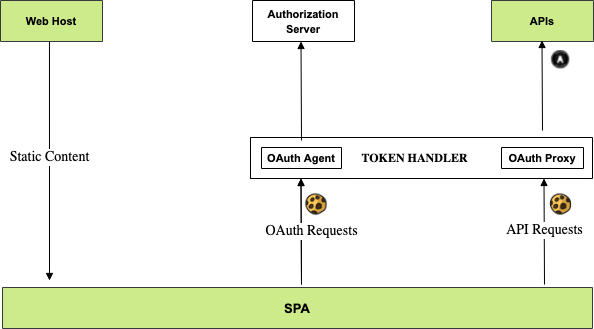

# OAuth Final SPA

[](https://app.codacy.com/gh/gary-archer/oauth.websample.final?utm_source=github.com&utm_medium=referral&utm_content=gary-archer/oauth.websample.final&utm_campaign=Badge_Grade)
 
[](https://snyk.io/test/github/gary-archer/oauth.websample.final?targetFile=spa/package.json)
[](https://snyk.io/test/github/gary-archer/oauth.websample.final?targetFile=webhost/package.json)
[](https://snyk.io/test/github/gary-archer/oauth.websample.final?targetFile=cloudfront-extensions/package.json)

## Overview

The final demo Single Page Application, which aims for a [Web Architecture](https://authguidance.com/web-architecture-goals/) with best capabilities:

- The SPA uses an API driven OpenID Connect solution based on the [Token Handler Example](https://github.com/curityio/spa-using-token-handler)
- Only the most secure cookies are used, with no tokens in the browser
- Only client side React technology is needed to implement the SPA, for productive development
- The SPA is deployed to many global locations via a Content Delivery Network (CDN)

## Components

The SPA architecture looks like this, where OAuth related components are hosted in the AWS cloud.\
Cookies are issued by an OAuth agent API, rather than a local web backend.\
This ensures that local web development is focused only on the React SPA:



## Views

The SPA is a simple UI with some basic navigation between views, which have a fictional investments theme.\
The data is returned from an API that authorizes access to resources using claims from multiple sources.


## Online System

The online version uses the AWS Cloudfront CDN to deliver static content to the browser.\
Login at https://web.authsamples.com/ with this AWS Cognito test account:

```text
- User: guestuser@mycompany.com
- Password: GuestPassword1
```

## Local Development Quick Start

Build code locally via this command, which runs `npm install` and `npm start`:

```bash
./build.sh
```

Custom development domains are used so you must add this DNS entry to your hosts file:

```bash
127.0.0.1 localhost web.authsamples-dev.com
```

Next configure [Browser SSL Trust](https://authguidance.com/2017/11/11/developer-ssl-setup#browser) for the SSL root certificate:

```
./certs/authsamples-dev.ca.pem
```

Then run this script in another terminal window to run a simple web host that serves static content.\
You can then edit the SPA's React code and update the UI productively, in a pure SPA manner.

```bash
./run.sh
```

When the browser is invoked at `https://web.authsamples-dev.com/`, sign in with the test account.\
You can then test all lifecycle operations, including expiry events, multi-tab browsing and multi-tab logout.

## Further Information

* See the [API Journey - Client Side](https://authguidance.com/api-journey-client-side/) for further information on the app's behaviour
* Further details specific to the SPA are provided, starting in the [Final SPA Overview](https://authguidance.com/final-spa-overview/)

## Programming Languages

* TypeScript and React are used to implement the SPA

## Infrastructure

* AWS Route 53 is used for custom hosting domains
* AWS S3 is used as the upload point for web static content
* AWS Cloudfront is used to distribute web static content globally, for equal web performance
* AWS Certificate Manager is used to manage and auto renew the Web Host's SSL certificate
* AWS Cognito is used as the default Authorization Server
* [AWS Serverless](https://github.com/gary-archer/oauth.apisample.serverless) or Kubernetes is used to host remote API endpoints used by the SPA
* Token handler components are used to implement API driven cookie issuing on behalf of the SPA

